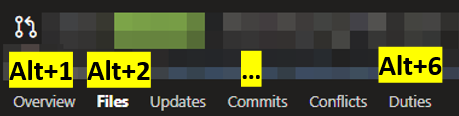
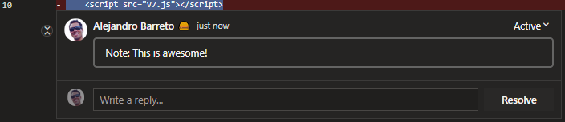
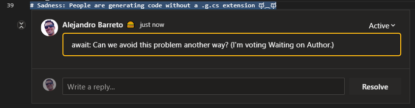
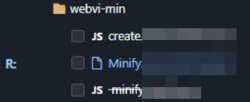
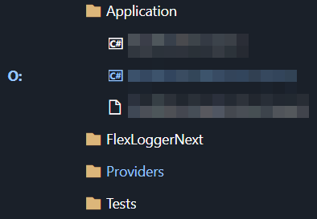
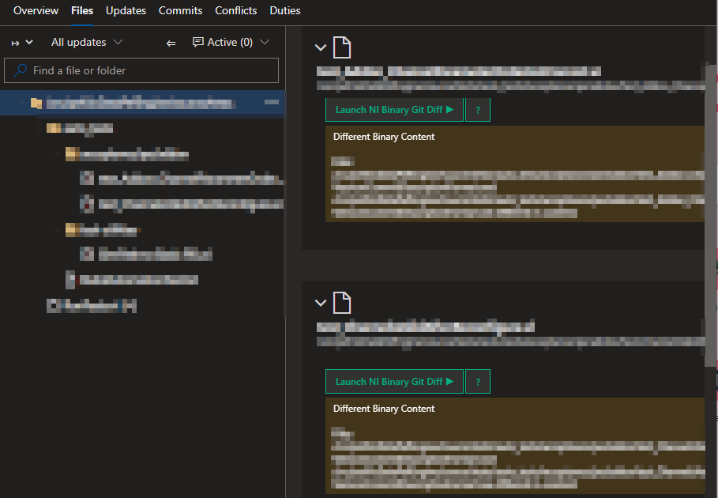

# More Awesome Azure DevOps (userscript)

   

A collection of userscripts to improve the Azure DevOps UI.

## Getting Started

1. [Install the Violentmonkey extension](https://violentmonkey.github.io/) (alternatively, [Tampermonkey](https://tampermonkey.net/))
2. Refresh this page if you just installed this extension (or the download link won't work)
3. [Install this userscript](https://github.com/alejandro5042/azdo-userscripts/raw/master/src/azdo-pr-dashboard.user.js)

By default, Violentmonkey and Tampermonkey will auto-update scripts from the original install location once a day. You can force an update from the extensions menu.

## Features

### PR dashboard improvements

- Reviews where you are the last reviewer are marked "Last Reviewer" in red
- Reviews show how many files you need to review
- Reviews show build status (if it's empty, there isn't a merge commit or a build configured)
- If a PR has bug work items associated with it, we add a label with the severity of such bugs (if SEV == 1 or 2)
- Repo pull request listings will also link to the overall account-wide PR dashboard
- At [NI](https://www.ni.com), some labels get coloring (e.g. "bypass owners" gets a red background)
- At [NI](https://www.ni.com), reviews are annotated with how long you've been on it if it's been over 1 weekday and you haven't voted or commented

### PR diff improvements

- An Edit button that quickly takes you to the edit UI for that file. No need to have source code or an IDE handy to make a quick edit!
- You can now use keyboard shortcuts to quickly switch between PR tabs (e.g. Overview, Files, etc). In Chrome, it'd be `Alt+1`, `Alt+2`, etc. In FireFox, it is `Alt+Shift+Num`. [See this table for details on your browser.](https://developer.mozilla.org/en-US/docs/Web/HTML/Global_attributes/accesskey)
    - 
- **[Not working at the moment](https://github.com/alejandro5042/azdo-userscripts/issues/95):** PR threads that start with `note:` (case insensitive) will appear expanded on page load, **even if they are closed**. They are also highlighted with a light border. Use this to mark interesting things for your reviewers in your PR!
    - 
- **[Not working at the moment](https://github.com/alejandro5042/azdo-userscripts/issues/95):** PR comments that start with `await:` (case insensitive) will appear highlighted. Use this to help developers focus their attention on the comments that you want to see again (e.g. the reason why you voted Waiting on Author or Rejected).
    - 
- **[Not working at the moment](https://github.com/alejandro5042/azdo-userscripts/issues/95):** Folder-level PR diffs are now syntax highlighted!
    > Note: Not all highlights will be correct; it can only highlight the code that appears in the diff; so multi-line strings may appear weird. Practically, these sorts of issues are rare and overshadowed by the benefit of syntax highlighting in all other cases.

### Better owners review (NI-only)

> These features are only available in [NI](https://www.ni.com) AzDO accounts.

- The PR file tree will now highlight the files you need to review with a letter to represent your role (Owner, Alternate, Reviewer):
    - 
- Collapsed files are highlighted if they contain files you need to review:
    - 
- In the multi-file diff view, your files are also highlighted with a blue hedaer (vs. the typical gray)
- Bypass owners reminder: For PRs into branches requiring a passing `ni/owners-approved` status, hovering over the Approve button pops up a reminder to consider bypassing owners
- Some tags/labels are colored (e.g. red if the label contains "Blocked")

### Overall

- Scrollbars throughout the site will now match the current Azure DevOps color theme
- Drop down menus are bigger!
- Prompts to add links to work items are much less prominent, unless hovered over
- "Show More" buttons on work item forms and on Kanban boards are auto-clicked for you! (But only if the New column is expanded)
- Work item forms show under the comment box who else is following the work item (disclaimer: also shows people that are only following state changes)

### Augmented build results view (NI-only)

> These features are only available in [NI](https://www.ni.com) AzDO accounts.

- The build results view will have an additional "Known Infrastructure Errors" section that lists known infrastructure errors under the build step that they occurred in.
- Additionally, in the Errors section, each error item from a build step that had infrastructure errors will be decorated with a warning indicator. All this is intended to make it easier to tell which errors are actual developer errors that need to be fixed.

### PREVIEW: Launch a protocol handler to diff NI Binaries

When using this userscript on Windows, a button to launch the "NI Binary Git Diff" protocol handler will be displayed.

This button will be added to binary files with the following extensions: `.vi`, `.vim`, `.vit`, `.ctt`, `.ctl`.

> Note: This is a preview feature. Please contact Humberto Garza (NI) for more details and instructions.

### PR trophies

Trophies are awarded for notable PRs and shown in a trophies section on the Overview tab. For example:

## Documentation

- [Support and troubleshooting](SUPPORT.md)
- [Contributing to this project](CONTRIBUTING.md)
- [GitHub Homepage](https://github.com/alejandro5042/azdo-userscripts)

## Privacy

The update URL goes through a URL redirect service to get a rough idea of how many people are using this script. To opt-out, change the update URL to the original download URL your usescript dashboard (or disable updates). This redirect service may also help if the URL needs to change; e.g. if the file is moved or renamed.

No other data is collected. The script is sourced and updated directly from the master branch of this repo.

## Credits

Inspired by a PR filtering script originally written by Tian Yu, which faded out approved PRs. Further improved by Alejandro Barreto.

## License

[MIT](LICENSE). Issues and pull requests welcomed!
