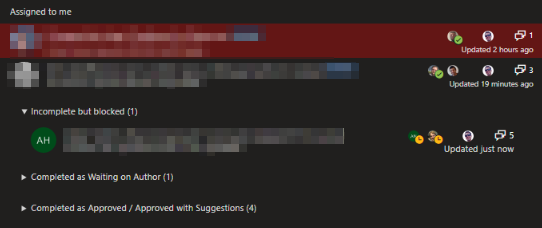
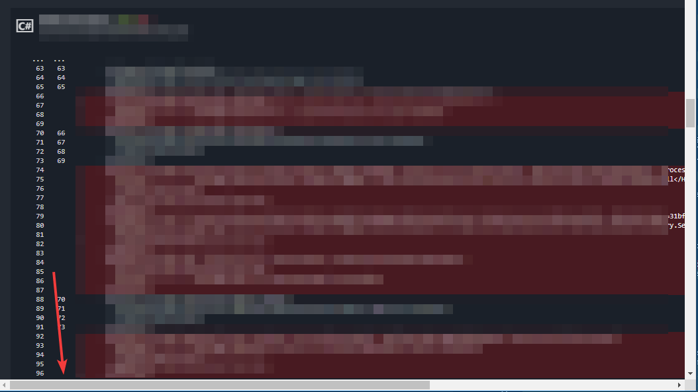

# Browser Userscripts For Azure DevOps

A collection of userscripts to improve the Azure DevOps UI. [(Homepage on GitHub)](https://github.com/alejandro5042/azdo-userscripts)

These userscripts were tested in Chrome and Firefox with the Tampermonkey extension. They may work with other setups.

## Getting Started

1) [Install the Tampermonkey extension](https://tampermonkey.net/)
2) Refresh this page if you just installed Tampermonkey (or the download link won't work)
3) [Install this userscript](https://github.com/alejandro5042/azdo-userscripts/raw/master/src/azdo-pr-dashboard.user.js)

By default, Tampermonkey will automatically update scripts from the original install location once a day. You can force an update from the extensions menu.

## Features

### PR dashboard improvements

Sorts the PRs in your dashboard into categories.

- Reviews are sorted from oldest to newest (reverse of the default)
- Reviews are highlighted red if you are the last reviewer and everyone else approved
- Reviews are further categorized into sections:
  - Uncategorized: Reviews you need to process
  - Incomplete but blocked: Reviews you have not completed but are blocked anyways because another reviewer voted Waiting on Author or Rejected. This section is open by default
  - Drafts
  - Completed as Waiting on Author
  - Completed as Rejected
  - Completed as Approved / Approved with Suggestions
  - Completed as Approved / Approved with Suggestions (with notable updates): PRs that have had notable activity after you've approved; e.g. lots of comments or non-approval votes
- Sections remember if they are open/closed
- PRs show how many files the reviewer needs to review

### PR diff improvements

- File checkboxes: Mark a file as reviewed (for yourself)
- Base selector: You can now select the base update to compare against
- Make the file name always visible in the multi-file diff view, even if the user scrolled down the page
- Make the horizontal scrollbar always visible in the multi-file diff view
  - Before (long lines are cutoff and the scrollbar may be offscreen): 
  - After (scrollbar is always visible): 

## Documentation

- [Support and troubleshooting](SUPPORT.md)
- [Contributing to this project](CONTRIBUTING.md)

## Privacy

The update URL goes through a URL redirector to get a rough idea of how many people are using this script. To opt-out, change the update URL to the original download URL in the Tampermonkey dashboard (or disable updates). The redirector can also help if the URL needs to change; e.g. if the file is moved or renamed.

No other data is collected. The script is sourced and updated directly from the master branch of this repo.

## Credits

This is the second version of a PR filtering script originally written by Tian Yu, which faded out approved PRs. Further improved by Alejandro Barreto.

## License

[MIT](LICENSE). Issues and pull requests welcomed!
