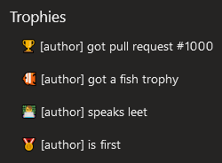

# Browser Userscripts For Azure DevOps

   

A collection of userscripts to improve the Azure DevOps UI.

These userscripts were tested in Chrome and Firefox with the Tampermonkey extension. They may work with other setups.

## Getting Started

1. [Install the Tampermonkey extension](https://tampermonkey.net/)
2. Refresh this page if you just installed Tampermonkey (or the download link won't work)
3. [Install this userscript](https://github.com/alejandro5042/azdo-userscripts/raw/master/src/azdo-pr-dashboard.user.js)

By default, Tampermonkey will automatically update scripts from the original install location once a day. You can force an update from the extensions menu.

## Features

### PR dashboard improvements

- Reviews where you voted "Waiting on Author" are faded out (and hover over yellow)
- Reviews where you are the last reviewer are marked "Last Reviewer" in red
- Reviews show how many files you need to review
- Reviews show build status (if it's empty, there isn't a merge commit or a build configured)
- If a PR has bug work items associated with it, we add a label with the severity of such bugs (if SEV == 1 or 2)
- At NI, some labels get coloring (e.g. "bypass owners" gets a red background)

### PR diff improvements

You can now mark a file as reviewed with a checkbox! The data persists in local browser storage, so if you come back to the PR later, the checkboxes will still be there (up to 3 weeks).

> Note: awesome.visualstudio.com checkbox data is separate from dev.azure.com/awesome checkbox data.

You can now select the base update to compare against with the base update selector:

This allows you to diff many updates at once:

> Note: The selector looks best in Chrome.

Some improvements to the multi-file diff view:

- The file name is now always visible, even if the user scrolled down the page
- The horizontal scrollbar is now always visible (but not for side-by-side diffs)

Before (long lines are cutoff and the scrollbar may be offscreen):

After (scrollbar is always visible):

You can now use keyboard shortcuts to quickly switch between PR tabs (e.g. Overview, Files, etc). In Chrome, it'd be `Alt+1`, `Alt+2`, etc. In FireFox, it is `Alt+Shift+Num`. [See this table for details on your browser.](https://developer.mozilla.org/en-US/docs/Web/HTML/Global_attributes/accesskey)

Reviewing a large PR? Press the auto-collapse button to make your tree manageable! (National Instruments: If you have an owners review, the button will keep folders open if they contain files you need to review.)

PR threads that start with `note:` (case insensitive) will appear expanded on page load, **even if they are closed**. They are also highlighted with a light border. Use this to mark interesting things for your reviewers in your PR!

PR comments that start with `await:` (case insensitive) will appear highlighted. Use this to help developers focus their attention on the comments that you want to see again (e.g. the reason why you voted Waiting on Author or Rejected).

### Bypass owners reminder

For PRs into branches requiring a passing ni/owners-approved status, hovering over the Approve button pops up a reminder to consider bypassing owners.

### PR trophies

Trophies are awarded for notable PRs and shown in a trophies section on the Overview tab. For example:

### Better owners review

> These features are currently specific to National Instruments.

The PR file tree will now highlight the files you need to review with a letter to represent your role (Owner, Alternate, Reviewer):

Collapsed files are highlighted if they contain files you need to review:

In the multi-file diff view, your files are also highlighted with a blue line on the left:

You can also press the new "Toggle other files" button to fade out and collapse the other diffs! (Ideally, I would hide them completely, but if I do, the AzDO interface bugs out.)

Hopefully all this makes it very easy to scan for the stuff you care about.

Note: If there is no owner info, or if you are not listed, nothing is highlighted and the button does not appear. It also only works with newer PRs (created or updated since approx. July 2019).

### Overall

Scrollbars site-wide now match the current Azure DevOps color theme.

Before :persevere:

After :smirk:

Also:

- Drop down menus are bigger!
- Prompts to add links to work items are much less prominent, unless hovered over

## Documentation

- [Support and troubleshooting](SUPPORT.md)
- [Contributing to this project](CONTRIBUTING.md)
- [GitHub Homepage](https://github.com/alejandro5042/azdo-userscripts)

## Privacy

The update URL goes through a URL redirector to get a rough idea of how many people are using this script. To opt-out, change the update URL to the original download URL in the Tampermonkey dashboard (or disable updates). The redirector can also help if the URL needs to change; e.g. if the file is moved or renamed.

No other data is collected. The script is sourced and updated directly from the master branch of this repo.

## Credits

This is the second version of a PR filtering script originally written by Tian Yu, which faded out approved PRs. Further improved by Alejandro Barreto.

## License

[MIT](LICENSE). Issues and pull requests welcomed!
